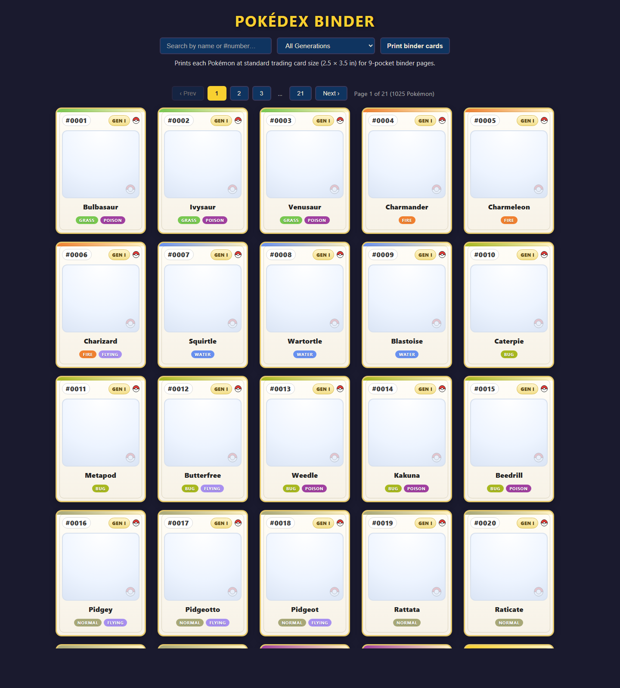

# Pokédex Binder

A browser-based printable Pokémon card binder for all 1,025 National Pokédex entries from Generations I–IX. The layout is designed to print onto standard trading-card sized inserts for 9-pocket binder pages.



## Features

Each card displays:
- **National Pokédex number**
- **Centered Pokémon sprite** in a card-style art frame
- **Pokémon name**
- **Type badge(s)** using Pokémon-inspired colours
- **Generation label**
- **Poké Ball decorative accents**

Additional UI:
- Paginated grid for easy browsing and batch printing
- **Generation filter** — jump straight to Gen I–IX
- **Search** — filter by name or Pokédex number
- **Print binder cards** button for printer-friendly output
- Printable layout sized for **2.5 × 3.5 inch** trading-card inserts

## How to use

Open [index.html](index.html) in any modern web browser, or serve the folder locally with a simple static server:

```bash
python -m http.server 8080
# or on some Windows setups:
py -m http.server 8080
```

Then open <http://localhost:8080>.

No build step or external dependencies are required.

## Printing tips

- Use the **Print binder cards** button in the app
- Print at **100% scale** for the most accurate card size
- Print one filtered generation or one page at a time if desired
- Best fit is standard **9-pocket card binder** sleeves

## Data sources

| Resource | Source |
|---|---|
| Pokémon names & types | Bundled in `data/pokemon.json` (generated from [PokeAPI](https://pokeapi.co/)) |
| Sprites | Loaded at runtime from `raw.githubusercontent.com/PokeAPI/sprites` |

### Regenerating data/pokemon.json

```bash
python generate_data.py
```

This downloads the latest CSV data from the [PokeAPI GitHub repo](https://github.com/PokeAPI/pokeapi) and writes the updated Pokémon data file.
